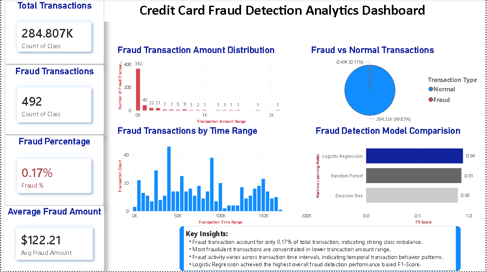
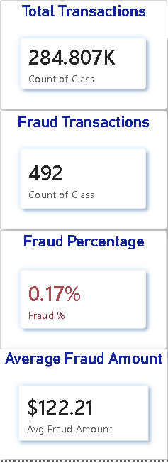
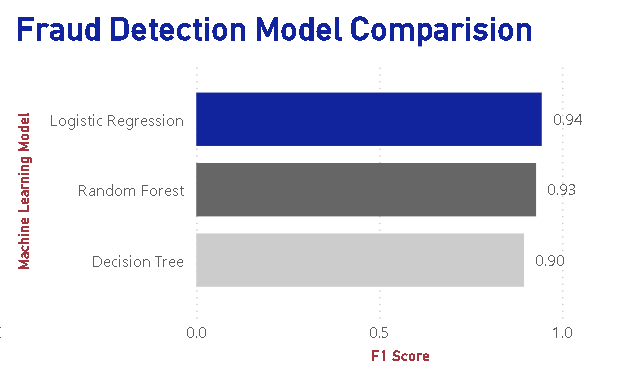

# Fraud Detection Project

End-to-End Fraud Detection Analytics Project using Python, Machine Learning, and Power BI

## Project Overview
This project focuses on analyzing credit card transactions to identify fraudulent activities using data analytics and machine learning techniques.

The objective is to perform data cleaning, exploratory data analysis (EDA), fraud pattern analysis, and build predictive models to detect suspicious transactions.

---

## Business Problem
Financial institutions lose millions due to fraudulent transactions every year. Detecting fraud accurately and quickly is important to reduce financial losses and improve customer security.

This project aims to analyze transaction patterns and identify high-risk fraudulent behavior.

---

## Dataset Information
Dataset used:
- Credit Card Fraud Detection Dataset

Source:
- Kaggle

Dataset contains:
- Transaction amount
- Transaction time
- PCA transformed features (V1 to V28)
- Fraud labels

Target Variable:
- `0` → Normal Transaction
- `1` → Fraudulent Transaction

---

## Tools & Technologies Used

### Programming & Analysis
- Python
- Pandas
- NumPy

### Data Visualization
- Matplotlib
- Seaborn

### Machine Learning
- Scikit-learn

### Dashboarding
- Power BI

### Version Control
- Git
- GitHub

---

## Project Workflow

1. Data Collection
2. Data Cleaning
3. Exploratory Data Analysis (EDA)
4. Fraud Pattern Analysis
5. Feature Engineering
6. Handling Imbalanced Data
7. Machine Learning Modeling
8. Model Evaluation
9. Dashboard Creation
10. Business Insights & Recommendations

---

## Exploratory Data Analysis (EDA)

Key analysis performed:
- Fraud vs normal transaction distribution
- Transaction amount analysis
- Time-based fraud analysis
- Correlation analysis
- Outlier detection
- Fraud trend visualization
- Hypothesis Testing
- Central Limit Theorem (CLT) Analysis

---

## Machine Learning Models
The following machine learning models were implemented and evaluated:
- Logistic Regression
- Decision Tree
- Random Forest

Evaluation Metrics:
- Precision
- Recall
- F1-Score
- ROC-AUC

---

## Key Insights
- Fraud transactions are extremely rare.
- Dataset is highly imbalanced.
- Certain high-value transactions show suspicious patterns.
- Fraud occurrence varies based on transaction behaviour.
 
---
 
 ## Power BI Dashboard Preview

### Full Dashboard


### KPI Section


### Model Comparison


---

## Project Structure

```text
Fraud_detection/
│
├── Fraud_Detection_Day1.ipynb
├── README.md
├── .gitignore
├── creditcard_cleaned.csv
└── images/
    ├── full_Dashboard.png
    ├── kpi_section.png
    └── model_comparison.png
```

## Project Highlights

- Performed fraud transaction analysis on highly imbalanced financial data.
- Built machine learning models for fraud detection and model comparison.
- Designed an interactive Power BI dashboard for fraud monitoring and business insights.
- Conducted statistical analysis, including hypothesis testing and correlation analysis.
- Implemented an end-to-end analytics workflow from data cleaning to dashboard visualisation.

---

## Future Improvements
- Real-time fraud detection system
- Streamlit deployment
- Advanced machine learning models
- Automated fraud alert system

---

## Author

Umang Verma  

Engineering Analyst 

Working on data analysis and business insights for Rolls-Royce aviation project

NIT Trichy - M.Tech Material Science  

